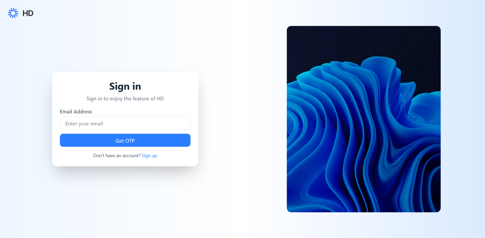
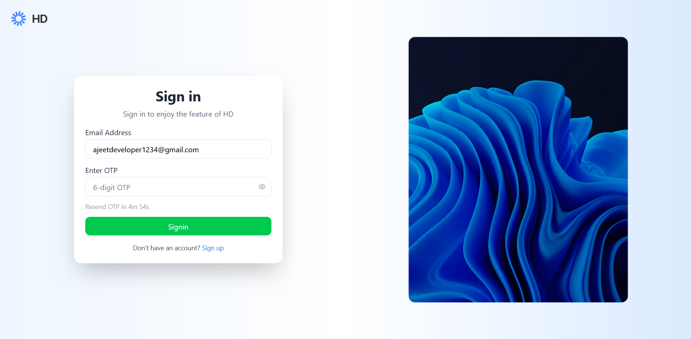
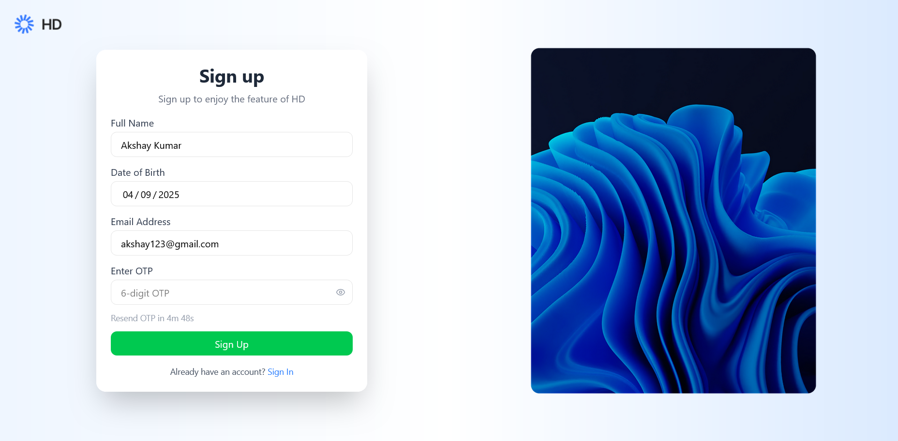
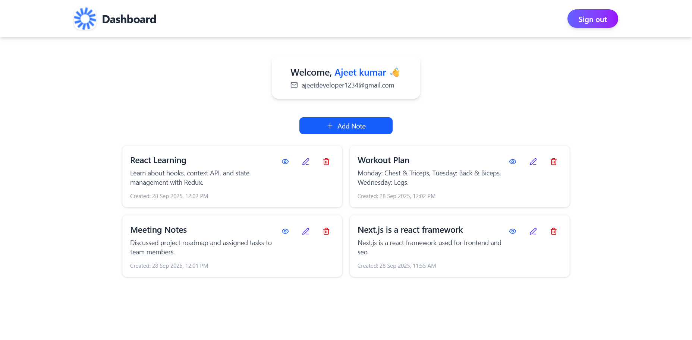
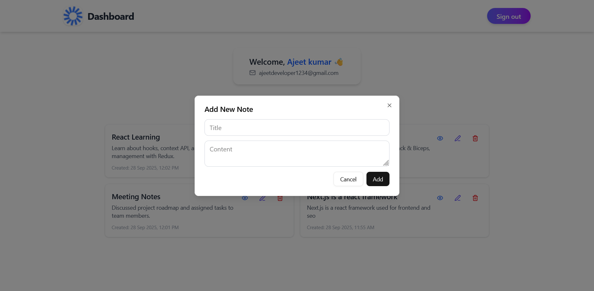
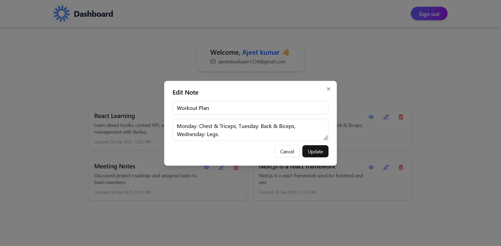
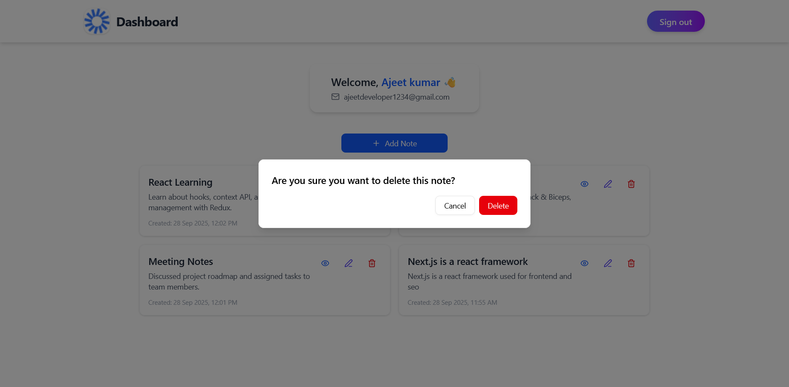
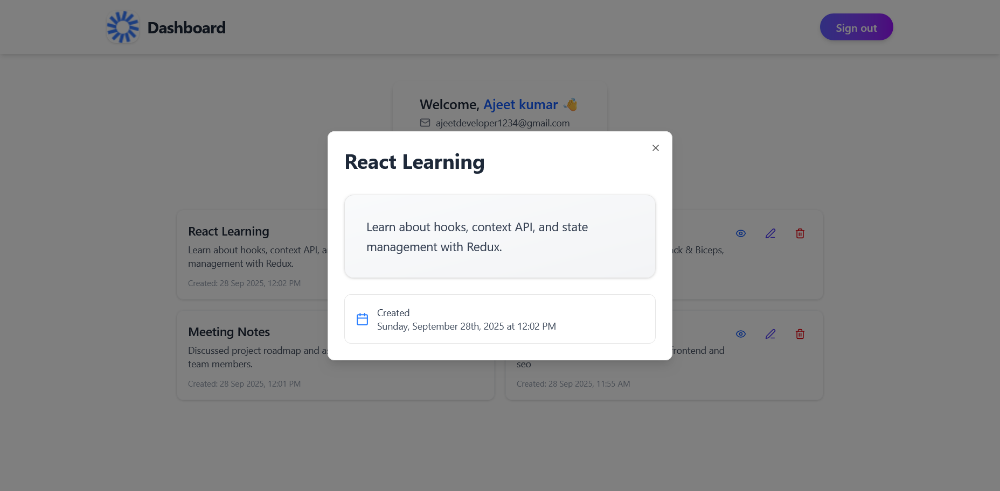

# 📝 HD NoteTaking - MERN Stack Application

<div align="center">
  
  
  [](https://www.mongodb.com/)
  [](https://expressjs.com/)
  [](https://reactjs.org/)
  [](https://nodejs.org/)
  [](https://www.typescriptlang.org/)
  [](https://tailwindcss.com/)
</div>

## 🚀 Overview

HD NoteTaking is a modern, full-stack note-taking application built with the MERN stack. It provides a seamless experience for users to create, view, edit, and delete notes with a beautiful, responsive interface. The application features OTP-based authentication, real-time notifications, and a modern UI built with shadcn/ui components.

## ✨ Features

### 🔐 Authentication
- **OTP-based Authentication**: Secure login/signup with email OTP verification
- **5-minute OTP Validity**: Time-limited OTP for enhanced security
- **Resend OTP**: Users can request new OTP with cooldown timer
- **Protected Routes**: Secure dashboard access

### 📝 Note Management
- **Create Notes**: Add new notes with title and content
- **View Notes**: Beautiful dialog view with full content display
- **Edit Notes**: Update existing notes seamlessly
- **Delete Notes**: Secure deletion with confirmation dialog
- **Real-time Updates**: Instant UI updates after operations

### 🎨 User Interface
- **Responsive Design**: Works perfectly on desktop, tablet, and mobile
- **Modern UI**: Built with shadcn/ui components and Tailwind CSS
- **Dark/Light Theme**: Beautiful gradient backgrounds
- **Toast Notifications**: Real-time feedback for all operations
- **Loading States**: Smooth loading indicators

### 🔧 Technical Features
- **TypeScript**: Full type safety across the application
- **State Management**: Zustand for efficient state management
- **API Integration**: RESTful API with proper error handling
- **File Upload**: Cloudinary integration for image uploads
- **Email Service**: SendGrid for OTP delivery

## 🛠️ Tech Stack

### Frontend
- **React 19** - Modern React with latest features
- **TypeScript** - Type-safe development
- **Vite** - Fast build tool and dev server
- **Tailwind CSS** - Utility-first CSS framework
- **shadcn/ui** - Beautiful, accessible UI components
- **React Router** - Client-side routing
- **Zustand** - Lightweight state management
- **React Hot Toast** - Beautiful toast notifications
- **Lucide React** - Beautiful icons
- **date-fns** - Date manipulation library

### Backend
- **Node.js** - JavaScript runtime
- **Express.js** - Web application framework
- **TypeScript** - Type-safe backend development
- **MongoDB** - NoSQL database
- **Mongoose** - MongoDB object modeling
- **JWT** - JSON Web Tokens for authentication
- **SendGrid** - Email service
- **Cloudinary** - Image upload and management
- **bcryptjs** - Password hashing
- **cors** - Cross-origin resource sharing

## 📸 Screenshots

<div align="center">
  <h3>🔐 Authentication Pages</h3>
  
  
   
  
  <h3>📱 Dashboard & Notes</h3>
  
 
  
  <h3>📝 Note Management</h3>
   
    
  
  
  
 

## 🚀 Getting Started

### Prerequisites
- Node.js (v18 or higher)
- MongoDB (local or cloud)
- Git

### Installation

1. **Clone the repository**
   ```bash
   git clone https://github.com/ajeetk7ev/hd-notetaking.git
   cd hd-notetaking
   ```

2. **Install Backend Dependencies**
   ```bash
   cd backend
   npm install
   ```

3. **Install Frontend Dependencies**
   ```bash
   cd ../frontend
   npm install
   ```

4. **Environment Setup**
   
   Create a `.env` file in the backend directory:
   ```env
   PORT=5000
   MONGODB_URI=mongodb://localhost:27017/hd-notetaking
   JWT_SECRET=your_jwt_secret_key
   SENDGRID_API_KEY=your_sendgrid_api_key
   CLOUDINARY_CLOUD_NAME=your_cloudinary_name
   CLOUDINARY_API_KEY=your_cloudinary_key
   CLOUDINARY_API_SECRET=your_cloudinary_secret
   ```

5. **Start the Application**
   
   **Backend (Terminal 1):**
   ```bash
   cd backend
   npm run dev
   ```
   
   **Frontend (Terminal 2):**
   ```bash
   cd frontend
   npm run dev
   ```

6. **Access the Application**
   - Frontend: http://localhost:5173
   - Backend API: http://localhost:5000

## 📁 Project Structure

```
HD-NoteTaking/
├── backend/
│   ├── src/
│   │   ├── config/          # Database and Cloudinary config
│   │   ├── controllers/     # Route controllers
│   │   ├── middlewares/    # Authentication middleware
│   │   ├── models/         # Database models
│   │   ├── routes/         # API routes
│   │   ├── utils/          # Utility functions
│   │   └── server.ts       # Server entry point
│   └── package.json
├── frontend/
│   ├── src/
│   │   ├── components/     # React components
│   │   │   ├── auth/       # Authentication components
│   │   │   ├── dashboard/  # Dashboard components
│   │   │   └── ui/         # shadcn/ui components
│   │   ├── pages/          # Page components
│   │   ├── store/          # Zustand stores
│   │   ├── types/          # TypeScript types
│   │   └── utils/          # Utility functions
│   └── package.json
└── README.md
```

## 🔧 API Endpoints

### Authentication
- `POST /api/auth/send-otp` - Send OTP to email
- `POST /api/auth/register` - Register new user
- `POST /api/auth/login` - Login user

### Notes
- `GET /api/notes` - Get all user notes
- `POST /api/notes` - Create new note
- `PUT /api/notes/:id` - Update note
- `DELETE /api/notes/:id` - Delete note

## 🎯 Key Features Implementation

### OTP Authentication Flow
1. User enters email and personal details
2. System sends OTP to email via Nodemailer
3. User enters OTP for verification
4. JWT token is generated upon successful verification
5. User is redirected to dashboard

### Note Management
1. **Create**: Users can add new notes with title and content
2. **View**: Beautiful dialog with full content and metadata
3. **Edit**: Seamless editing with real-time updates
4. **Delete**: Secure deletion with confirmation dialog

### State Management
- **Auth Store**: Manages authentication state and user data
- **Notes Store**: Handles CRUD operations for notes
- **Real-time Updates**: Instant UI updates after operations

## 🚀 Deployment

### Backend Deployment (Railway/Heroku)
1. Connect your GitHub repository
2. Set environment variables
3. Deploy automatically on push

### Frontend Deployment (Vercel/Netlify)
1. Connect your GitHub repository
2. Set build command: `npm run build`
3. Set output directory: `dist`
4. Deploy automatically

## 🤝 Contributing

1. Fork the repository
2. Create a feature branch (`git checkout -b feature/amazing-feature`)
3. Commit your changes (`git commit -m 'Add some amazing feature'`)
4. Push to the branch (`git push origin feature/amazing-feature`)
5. Open a Pull Request

## 📝 License

This project is licensed under the MIT License - see the [LICENSE](LICENSE) file for details.

## 👨‍💻 Author

**Your Name**
- GitHub: [@ajeetk7ev](https://github.com/ajeetk7ev)
- LinkedIn: (https://www.linkedin.com/in/ajeet-kumar-98b305259/)
- Email: ajeetk8568@gmail.com

## 🙏 Acknowledgments

- [shadcn/ui](https://ui.shadcn.com/) for beautiful UI components
- [Tailwind CSS](https://tailwindcss.com/) for utility-first CSS
- [Lucide React](https://lucide.dev/) for beautiful icons
- [React Hot Toast](https://react-hot-toast.com/) for toast notifications

---

<div align="center">
  <p>Made with ❤️ using the MERN Stack</p>
  <p>⭐ Star this repository if you found it helpful!</p>
</div>
